# ceph-notes
**Ceph** is presented as a **unified, open-source storage platform** designed to provide scalable and reliable data services across commodity hardware. At its core is **RADOS**, an intelligent layer that manages data distribution, replication, and hardware failures using the **CRUSH algorithm** to calculate data placement without a central lookup table. The system supports three primary interfaces: **CephFS** for file storage, **RBD** for block storage, and **RGW** for S3-compatible object storage. To ensure high availability, Ceph distributes data across different **failure domains** while providing advanced features like **snapshots, thin provisioning, and multi-site geo-replication**. The ecosystem is supported by a global **open-source community** and a foundation that integrates the software with major cloud platforms like **OpenStack and Kubernetes**. Management is simplified through a centralized **dashboard** and automated orchestration tools that monitor cluster health and performance metrics.

All of the three types of storage provided by `ceph` are on top of LIBRADOS storage API, that speaks to RADOS storage as follows.

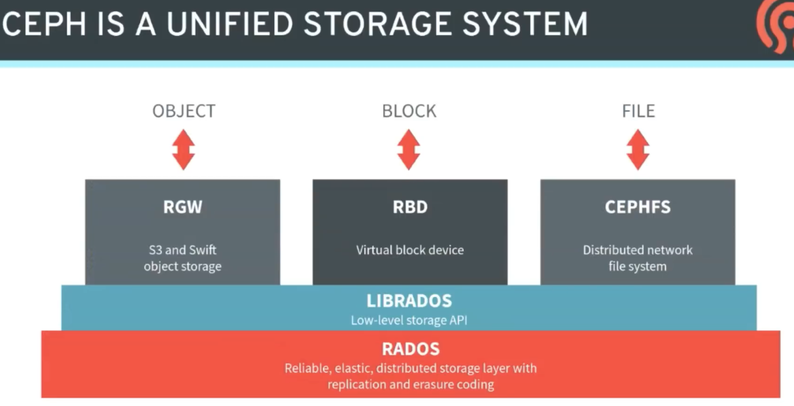

It has its monitoring component `ceph-mon`, manager `ceph-mgr`, and storage daemons `ceph-osd`

## Arch
App > LIBRADOS > RADOS Cluster

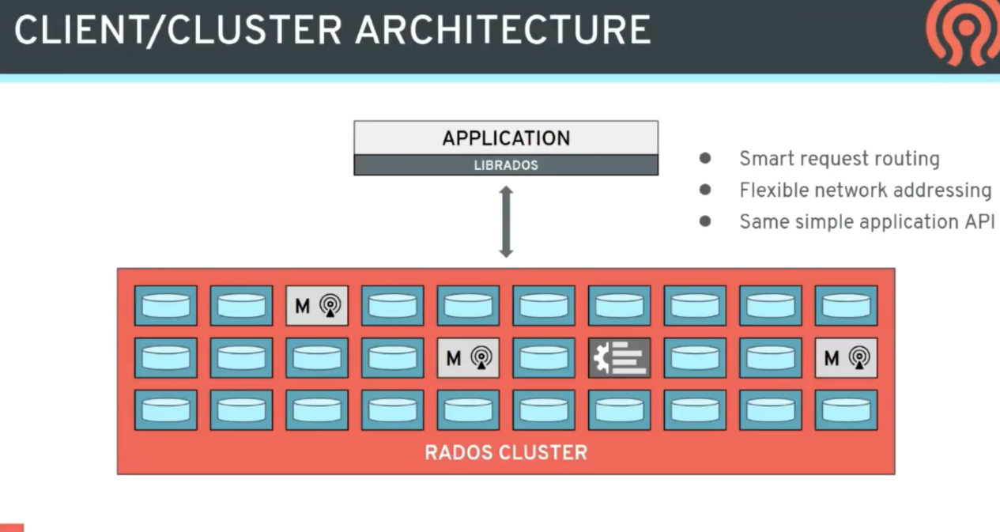
As shown, manager is object, monitor is some objects, rest are data.

## Data Placement
Where to store objects?
It's a lot of objects, so we need a map
- while running, it get a map of cluster
- calc correct object location
- R/W to appropriate OSD 
IF
- one device failed
- repeate the above to re-locate the object somewhere else.

So how video is stored in ODS?

Vid > obj > pool > fregmanted to placement group > each stored in different ods
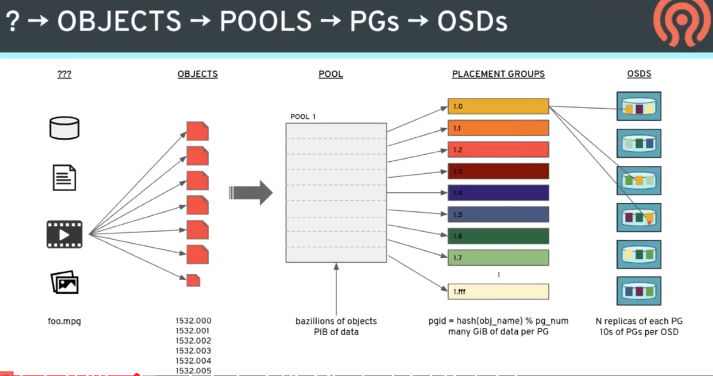

### There are type of mirrorring
- Devices
    if one fail, 
        - only one disk throughput bottlenecked
        - must have another disk with the same size available
    if triple fail
        - entire disk goes
- Placement groups
    if fail, 
        - more PG is replicated
        - more than one disk thoughput
        - parllel and faster in replication
    if triple fail
        - one PG lost
- Objects
    if fail, 
        - all disk participate in recovery process
    if triple fail:
        - some of object lost
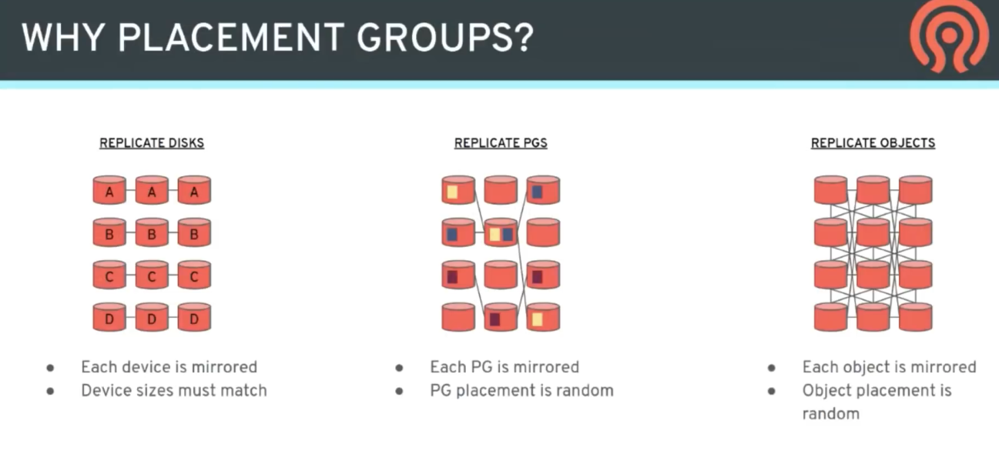

## So how to avoid concurrent failure??
- Create hierarchy of SD
- Express placement policies over in terms hirarchy 
    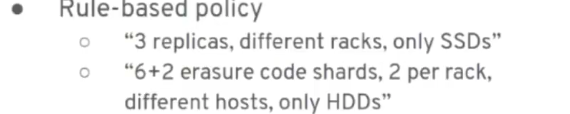
- Separate replicas over domain

## CRUSH Algorithm for placing PGs
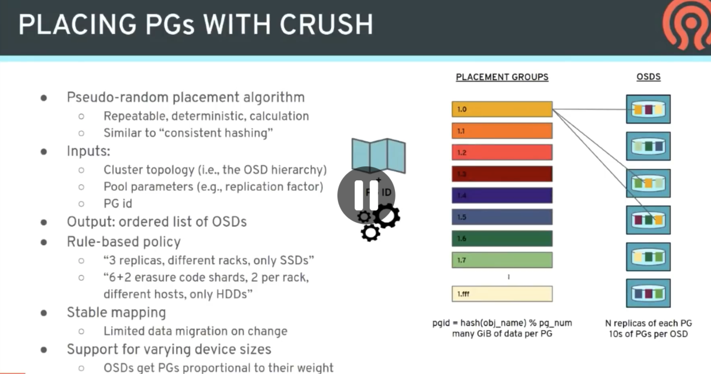

## Replication and Erasure code
Erasure: 
- fragment the objet over `k` of PGs
- `m` is PG shard number has the same object
- slow in revcovery
- better for large system than replication, as it doesn't duplicate the objects

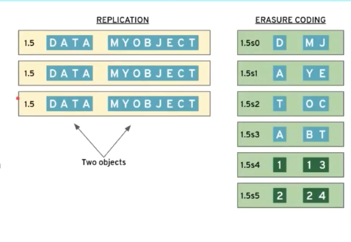

# RGW RADOS Gateway (S3)

ACL-based permission
RGW strips TB of data across RADOS objects

how data is PUT in RADOS in RGW

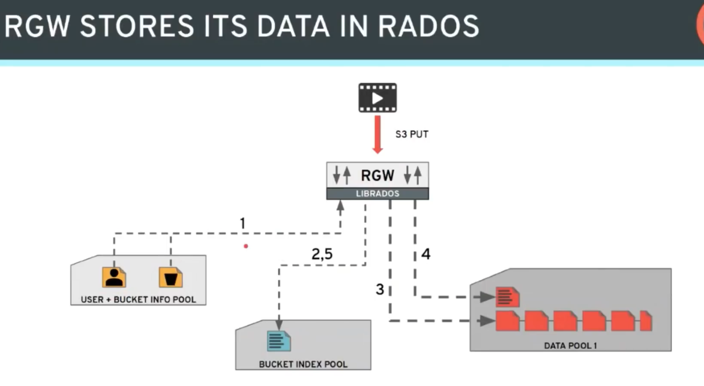

RGW can be grouped in zones even in different regions.
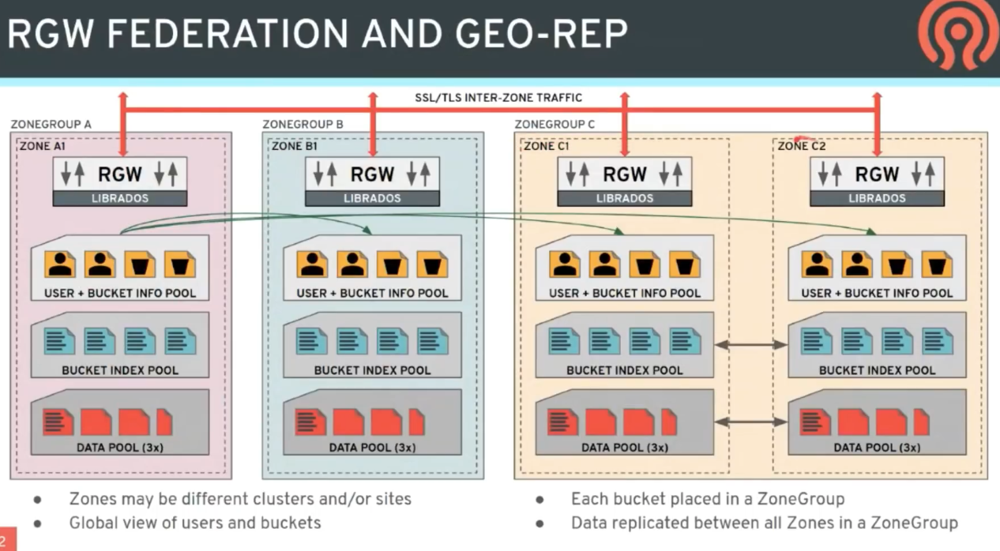

Actual data transfare is only through the Gateways, the arrows between pools are meant for replication only not data transfare.

# RBD RADOS Block Device
There is a pool of RBD
call to gether to be as a single device of Linux of for KVM using LIBRBD > LIBRADOS
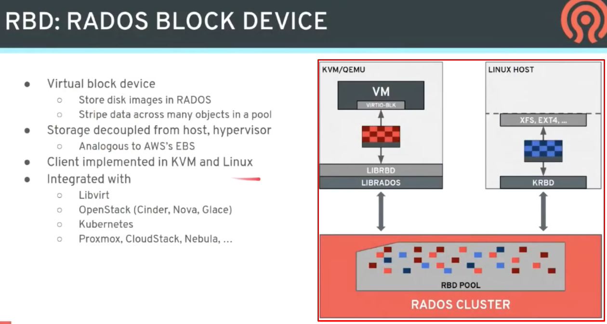

### Data layout
Data object id 4MB
Image has headers (metadata), but it doesn't allocate storage until data is written
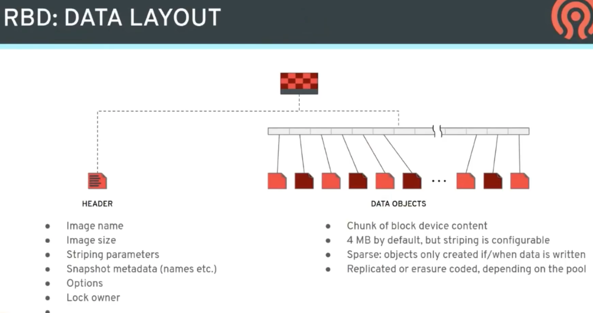

### Journal RBD
It write journals for all changes in the image
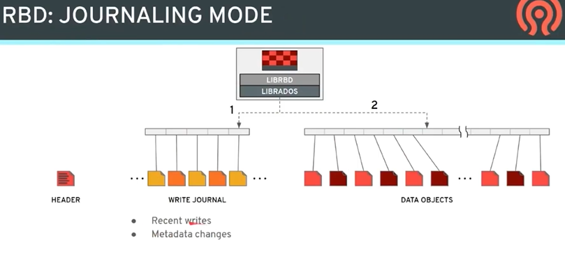

